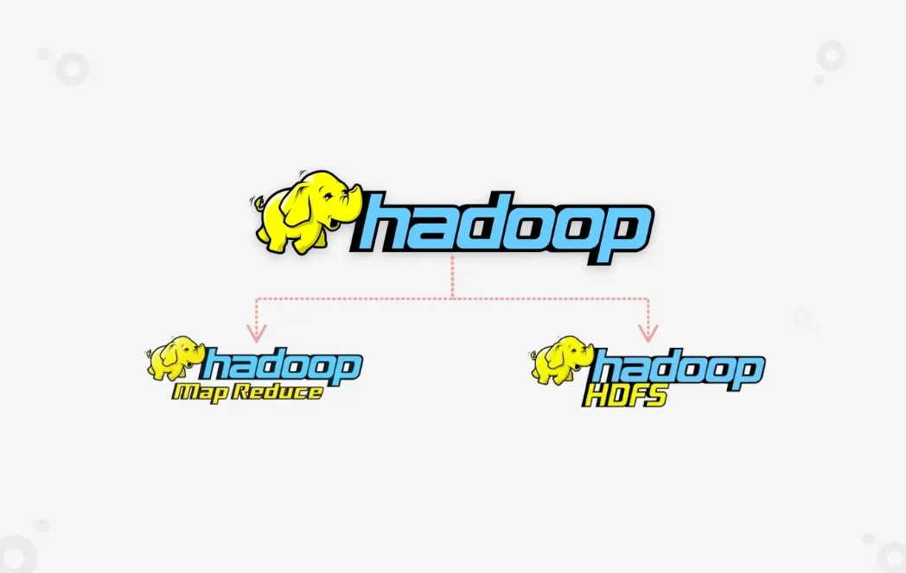
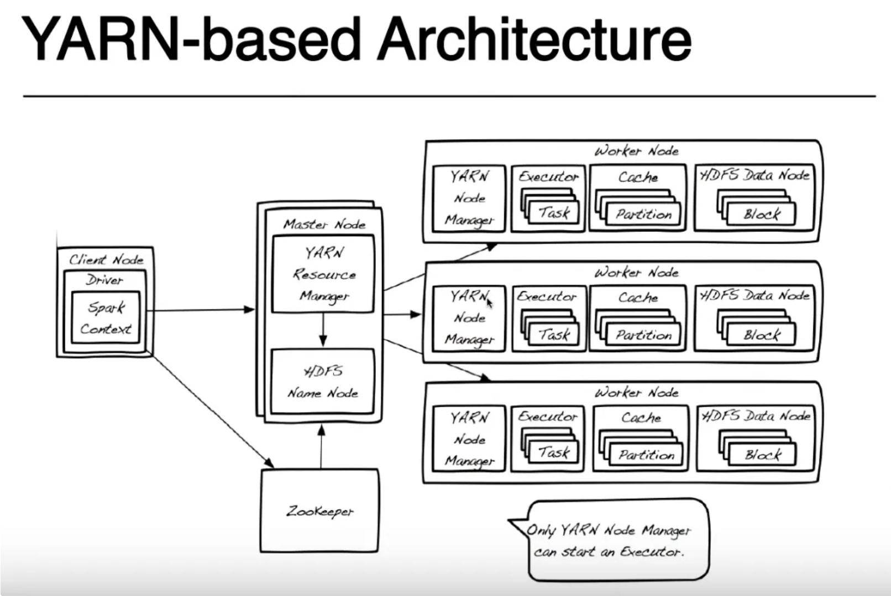
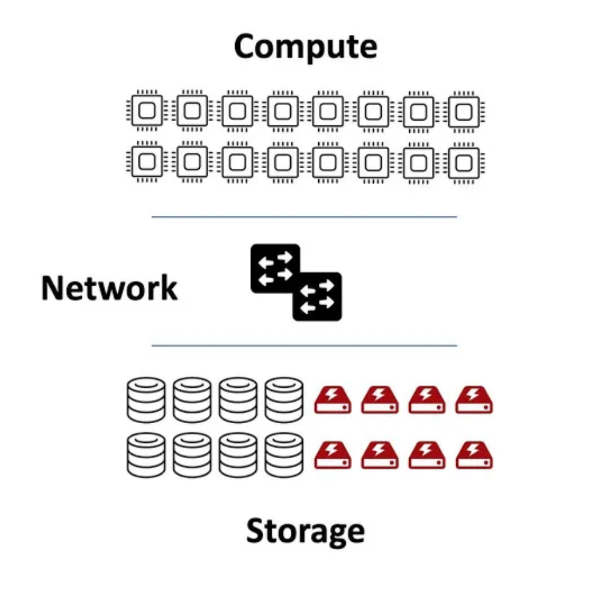
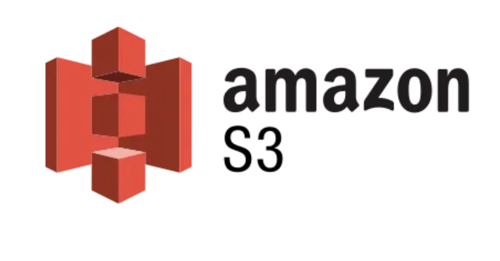
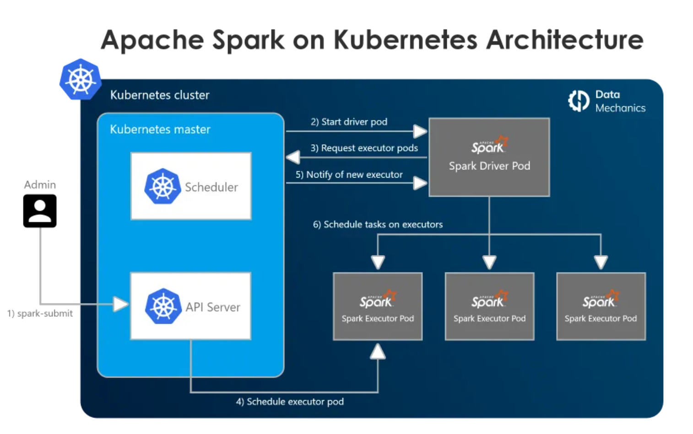
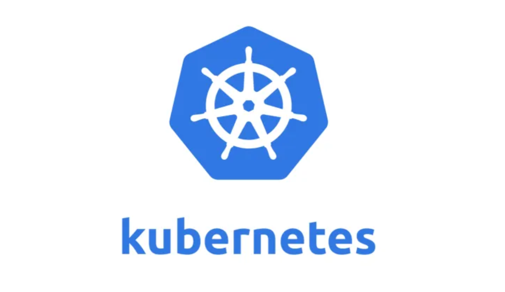
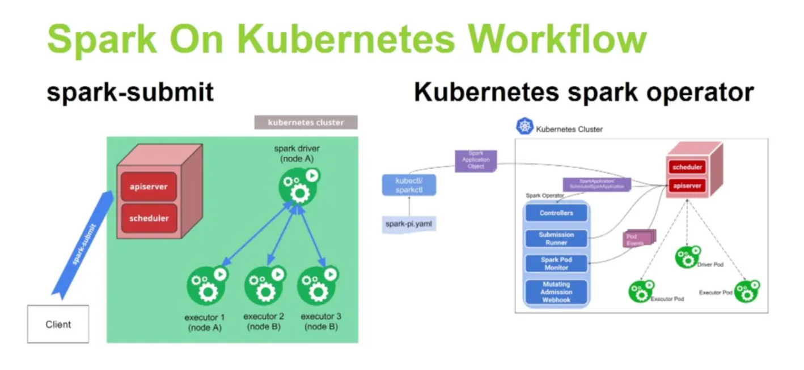
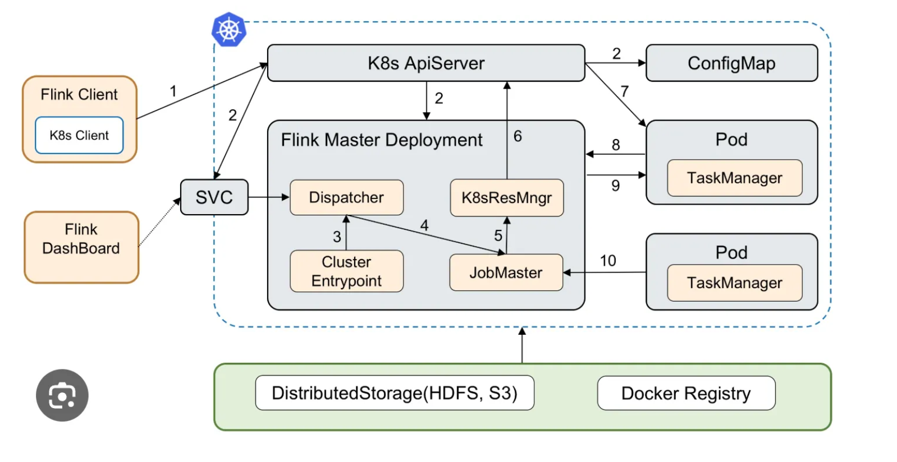

> When Apache Hadoop first emerged, it quickly became the dominant force in the big data ecosystem. Many companies adopted it as their **primary big data solution**, and an entire ecosystem of tools and technologies—such as Hive and HBase—grew around it. However, in recent years, Hadoop has gradually been replaced by newer technologies. What led to this shift? Let's explore the reasons.
> 

# 🚀 Introduction

    

Since the release of **Hadoop 2.x**, it has been widely used as a big data solution across industries. Hadoop consists of three **core components**:

- **HDFS (Hadoop Distributed File System)** – Handles storage.
- **YARN (Yet Another Resource Negotiator)** – Manages cluster resources.
- **MapReduce** – Processes large-scale data using a batch computation model.

Hadoop's strength lies in its **distributed computing approach**, where storage and computation are managed within the same cluster. **DataNodes and NameNodes** work together to store and replicate massive datasets, while **ResourceManager and NodeManager** manage computing resources. **MapReduce follows a "Map & Reduce" paradigm**, enabling large-scale distributed computations.

Initially, Hadoop was the **go-to solution** for big data processing. Its open-source nature led to the development of **a rich ecosystem** of tools, including **Hive, HBase, and others**, forming a complete big data stack.

# 🚀Why Was Hadoop Replaced?

Hadoop’s **three core components**—HDFS (storage), MapReduce (computation), and YARN (resource management)—each have their own limitations. Over time, these shortcomings led to the gradual decline of Hadoop's dominance.

## 🔥 1. Computation: The Fall of MapReduce

Originally, Hadoop used **MapReduce** as its computing engine. While **Java-based MapReduce** allowed developers to handle complex computation logic, **it required writing a lot of Java code**.

### The Rise of Hive

With the introduction of **Hive**, users could write SQL-like queries instead of Java code. **Hive's Driver and Compiler** translated SQL into MapReduce jobs, significantly improving **developer efficiency**. However, MapReduce had a fundamental performance limitation: 

- **It relied heavily on disk I/O**, leading to **slow processing speeds,**
- as well as even with optimizations like **Tez**, MapReduce still struggled to match modern computation engines.

### **Hive on Spark: Breaking MapReduce’s Limits**

The introduction of **Apache Spark** marked a major breakthrough:

- **Spark is memory-based** and processes data up to **10 times faster than MapReduce**.
- It provides **rich APIs** (RDD, DataFrame) in Java, Scala, and Python, making it easier for developers to use.
- Hive adapted to Spark’s speed by allowing users to switch **MapReduce to Spark as the execution engine**.👉 **This setup became known as "Hive on Spark".**

### **Shark: A Short-Lived Experiment**

Before **Spark SQL**, the **Shark project** allowed users to execute Hive SQL directly on Spark. Shark translated **Hive SQL into Spark RDD operations**, bypassing MapReduce entirely. However, as **Spark SQL** introduced its **Catalyst Optimizer and Tungsten Execution Engine**, Shark became obsolete and was eventually discontinued.

    

### The Shift to 100% Spark

Whether using **Hive on Spark** or **Shark**, users were still writing **HiveSQL (HQL)**. The only difference was that the execution engine changed to **Spark**, which offered better performance. However, the framework itself remained an **HQL-based architecture**, mainly designed for **data warehouses**. It supported the **Hive ecosystem**, including **Metastore, UDF, and HDFS storage**, which is why many companies continued using it for a long time.

Over time, companies began to **move away from HiveQL** and fully adopt **Spark**.

With **Spark computing directly**, users could execute data operations using **SparkCore (RDD API) and SparkSQL** without relying on **Hive to parse SQL and convert it into Spark tasks**. This **improved performance significantly** and also **enabled real-time processing (Streaming)**.

As a result, **Spark became the main computation engine for many companies**. By writing **SparkSQL**, they could analyze and process large-scale data more efficiently.

Many companies adopted a **new technology stack: HDFS + Spark + YARN**:

- **Data was still stored in HDFS within a Hadoop cluster.**
- **YARN managed computing resources using its ResourceManager.**
- **A dedicated Spark client submitted Spark jobs**, compiled Spark code, and sent the tasks to **YARN for execution**.

The only difference was that

**Spark replaced MapReduce as the execution engine.** 👉**This is what we call the "Spark on YARN" architecture.**

## 🔥 **2. Storage Layer**

## **HDFS Core Weaknesses**

| Weakness | Issue |
| --- | --- |
| **Small Files Problem** | HDFS is optimized for storing large files (e.g., GB-level logs) but struggles with many small files (e.g., KB-sized data). Since NameNode stores metadata for each file, too many small files put excessive pressure on it. |
| **Poor Random Read/Write Performance** | HDFS is designed for **large-scale sequential reads/writes** but is **not suitable for low-latency random access**, making it inefficient for database transactions or NoSQL workloads. |
| **High Storage Cost** | HDFS stores **three copies** of each data block by default, using **three times the storage space**, increasing storage costs. |
| **Single Point of Failure (NameNode Dependency)** | NameNode manages metadata. If NameNode fails, the entire HDFS may become unavailable (although HA mode reduces this risk). |
| **Limited Data Updates** | HDFS primarily supports **append-only writes**, meaning files **cannot be modified** (only rewritten entirely), making it unsuitable for **OLTP workloads**. |
| **Not Suitable for Low-Latency Queries** | HDFS requires **MapReduce or Spark** for data processing, leading to **high query latency**. It is not designed for interactive database-style queries. |
| **Lack of Scalability** | Since **storage and computing are coupled**, expanding HDFS requires **adding new Hadoop nodes**, rather than just increasing storage capacity. This increases **operational costs**. |

## **The Architecture of Compute-Storage Coupling**

In this architecture, the **Hadoop cluster** handles **HDFS storage**, while **Spark submits jobs to YARN** for computation. **Essentially, this means compute and storage remain tightly coupled within the same cluster.**

### **Spark on YARN: Job Execution Process**

    

1. **Spark Client Node submits a Spark job to YARN** (requesting resources from YARN).
2. **YARN ResourceManager schedules computing resources**:
    - It starts **ApplicationMaster**, which manages the job lifecycle.
    - It allocates **Executors** on **YARN NodeManagers**, which execute Spark tasks.
3. **Executors process the Spark tasks** and return results to the **Driver on the Spark Client Node**.
4. Since data is stored in **HDFS DataNodes**, Executors must **fetch data from these storage nodes** during computation.

**How Compute-Storage Coupling Works in Hadoop**

- **Each Worker Node** handles both **storage (HDFS DataNode)** and **computation (NodeManager + Executor)**.
- The **Master Node** (ResourceManager + NameNode) centrally manages **both compute resources and storage**.

**That being said, every compute unit and storage unit are coupling in one worker node. Hadoop’s Data Locality optimization** ensures tasks run on nodes where data is stored, reducing network transfer. However, this architecture introduces several **limitations** in large-scale workloads.

## ❌ **Problems with Compute-Storage Coupling**

1. **Compute and storage cannot scale independently**:
    - **Storage scaling**: When data grows, new nodes must be added, even if more compute power isn’t needed. This leads to **resource waste**.
    - **Compute scaling**: When computational demand increases but storage does not, **scaling the entire cluster is required**, increasing costs.
    - **High maintenance overhead**: Expanding Worker Nodes in Hadoop requires **manual configuration**, reducing **flexibility in scaling**.
2. **Compute and storage compete for resources**:
    - Compute tasks **must wait for storage node resources**, causing **processing delays**.
    - During peak loads (e.g., **AI training, large-scale data analysis**), **storage nodes can become bottlenecks**.
    - Since a **single server handles both HDFS storage and Spark execution**, it can lead to:
        - **I/O contention** (disk read/write competition).
        - **Insufficient memory** (data storage vs. Spark execution).
        - **CPU overload** (both computation and storage operations running simultaneously).
3. **Inefficient hardware utilization**:
    - **Unbalanced compute workload**: Some nodes are heavily loaded, while others remain idle.
    - **Uneven storage load**: HDFS follows a **three-replica strategy**, sometimes leading to **unequal data distribution**, increasing storage pressure on some nodes.

# 🚀 **Storage-Compute Separation**

The **Storage-Compute Separation** architecture **decouples storage from computation**, meaning computing tasks no longer depend on storage nodes. **Data storage is managed by an independent distributed storage cluster** (e.g., AWS S3), while **computation frameworks like Spark and Flink read data remotely to perform processing**.

    

## ✅ **Advantages of Storage-Compute Separation**

### **1. Independent Scaling of Storage and Compute**

**Compute nodes can scale up or down as needed**:

- During peak demand, more compute resources can be added quickly.
- During low demand, compute resources can be reduced to save costs.

**Storage nodes can also scale independently** without affecting compute resources.

This eliminates the **storage or compute bottleneck found in traditional Hadoop systems**.

### **2. Lower Operational Costs**

    

**Hadoop HDFS requires manual management** of NameNode, DataNode, storage expansion, and replication policies. If storage is insufficient, **new Hadoop Worker nodes must be added along with disks**. If NameNode fails, **HDFS may become unavailable unless HA (High Availability) is configured**.

**Cloud storage makes operations much simpler**:

- **For example, AWS S3 automatically handles storage management**—no need to maintain NameNode/DataNode manually.
- **Cloud storage can scale automatically**, eliminating the need to manually add machines.
- **Data remains available even after compute tasks finish**, whereas HDFS may require manual cleanup.

### 3. Replacing YARN with Kubernetes

    

In Hadoop ecosystems, compute frameworks like **Spark, Flink, and Hive** depend on **YARN** as the resource manager. This limits flexibility, making it difficult to integrate with **Kubernetes and Serverless environments**.

**With storage-compute separation, Kubernetes can manage compute resources**:

- **Run Spark on Kubernetes (Spark on K8s) instead of YARN**.
- **Run Flink on Kubernetes (Flink on K8s) for dynamic scaling**.
- **Kubernetes automatically handles scaling, failure recovery, and resource allocation**.

### **4. More Suitable for Cloud Computing & Multi-Region Deployment**

**Hadoop YARN is limited to a single data center**:

- Compute tasks **must run within the same data center** where YARN is deployed.
- Data migration to another data center requires **manual synchronization of HDFS data**.

**With storage-compute separation**:

- **Storage**: Object storage like **S3 / MinIO / Ceph** can be deployed across multiple regions and clouds.
- **Compute**: Compute clusters can be deployed **on Kubernetes**, allowing **on-demand scaling in any cloud**.

### **5. Cost Efficiency**

**Compute resources are released immediately after tasks finish**, reducing costs.

**Storage uses cost-effective cloud storage** instead of maintaining expensive HDFS clusters.

**Cloud-based pay-as-you-go pricing maximizes resource utilization**.

# 🚀 **Kubernetes in Cloud Data Engineering**

In modern cloud environments, **Kubernetes (K8s)** has become the standard for container orchestration.

It provides **high flexibility and scalability** for **data storage, processing, and streaming analytics**.

    

## **Distributed Data Storage**

Kubernetes allows managing and running **distributed storage systems**, such as:

- **Object storage (S3-compatible)**: MinIO, Ceph
- **Distributed file storage**: HDFS on Kubernetes
- **Relational databases**: PostgreSQL, MySQL
- **NoSQL databases**: Cassandra, MongoDB, Elasticsearch

### 📍 **Example: HDFS on Kubernetes**

Running **HDFS on a Kubernetes cluster** allows **dynamic scaling of DataNodes** to store **petabytes (PB) of data**. **Persistent Volume Claims (PVC)** help manage storage resources efficiently.

## Batch Data Processing

    

### 📍 **Example: Apache Spark on Kubernetes**

- **Spark Driver runs on the K8s Master node**, handling job scheduling.
- **Spark Executors run as Pods**, dynamically scaling based on demand.
- **Data is stored in HDFS or S3**, and Spark jobs read directly from storage.

This approach **removes the need for Hadoop YARN**. **Spark Executors run directly on Kubernetes Pods**, allowing **elastic scaling**. **When a job finishes, compute resources are released automatically**, reducing costs.

## Real-Time Stream Processing

    

### 📍 **Example: Flink on Kubernetes**

- **Kafka produces real-time data streams**.
- **Flink runs on Kubernetes**, with **TaskManagers deployed as Pods** to process streaming data.
- **Results are stored in NoSQL databases or data lakes (S3, HDFS)**.

This setup ensures **high availability**: If a **Flink Pod crashes, Kubernetes automatically restarts it**. Flink can **scale dynamically based on real-time data flow**, improving efficiency.

---

# 去Hadoop化：存算分离和基于Kubernetes的云端数据工程的实践

> Apache Hadoop从当时的一家独大，让大数据的生态围绕在Hadoop上展开，成为几乎所有公司的大数据主流解决方案。到如今的逐渐被替换，到底发生了什么事情？谈谈我的理解。
> 

# 🚀 Introduction

    

自从Hadoop 2.x问世，它已经作为很多公司的大数据解决方法。Hadoop有三个核心组件：

- HDFS负责存储
- Yarn负责资源管理
- MapReduce负责计算

Hadoop的一个特点就是利用了分布式的思想，让存储资源和计算资源在一个集群下统一管理，通过DataNode和NameNode之间工作，来实现海量数据的存储、备份，以及通过ResourceManager和NodeManager，来管理分布式的数据计算资源，基于Map和Reduce的分治（Divide and Conquer）算法思想，对海量数据进行计算。

在早期，随着Hadoop框架的开源，几乎是大部分公司在大数据领域的唯一化解决方案，并且衍生出来了很多很多新的技术，比如Hive，HBase等Hadoop生态下的流行顶级项目，共同组成了大数据的一套成熟的解决方案。

# 🚀 Hadoop的弊端

Hadoop的三大组件：HDFS负责存储、MapReduce负责计算、Yarn负责资源管理，他们有什么缺点，为什么最后被逐渐取代了？

## 🔥 1. 计算层：MapReduce的陨落

原先Hadoop是基于MapReduce进行计算，MapReduce对Java的支持，使得可以解决很多很复杂的计算逻辑，但是用户还是需要手写大量的Java代码。

### Hive的兴起

随着Hive的出现，用户可以通过SQL来实现复杂逻辑的计算，Hive Driver和Hive Compiler等组件负责解析用户提交的SQL语句并且转换为MapReduce任务，大大提升了开发者的开发效率。但是MapReduce因为是基于磁盘计算的，其性能非常有限。即使随着Tez计算引擎的出现，计算性能上有所提升，仍然整体差强人意。

### Hive on Spark

Spark的出现，对MapReduce进行了突破。Spark是基于内存计算，并且提供了丰富的RDD算子计算，让Java/Scale/Python开发者，可以写RDD函数或者DSL函数，来完成对Spark的开发，并且通过内存计算，近100倍于之前MapReduce的执行效率。

Hive当时作为大数据的一个主流数仓管理工具，原本是通过Metastore存储元数据，来读取HDFS上的数据，通过SQL编译器来执行MapReduce任务，后来，**Hive通过对计算引擎的配置，让计算通过Spark来进行，而不是MapReduce或者Tez。这就是我们常说的Hive on Spark。**

### Shark（已被淘汰）

这个概念，可能大部分资深的Data Engineer都听说过，是Spark社区早期的一个项目，目的是让用户提交Hive SQL在Spark上运行（用户写 Hive SQL，Shark 解析并转换为 Spark RDD 任务）但是后来出现了SparkSQL，这个项目就停止了。

    

### The Shift to 100% Spark

Hive on Spark或者Shark也好，用户仍然写的是HiveSQL（HQL），只是任务提交到Spark执行引擎而已，由性能更强的Spark进行计算。但是整个框架仍然还是HQL框架，这套框架主要是适用于数据仓库场景，支持hive生态，如Metastore、UDF、HDFS存储，所以能一直在很多公司沿用到现在。但是渐渐地，人们开始淘汰HiveQL的框架，转而100%投入到Spark的怀抱。

而Spark直接计算，是用户直接通过SparkCore（RDD API） 和 SparkSQL直接来执行数据的计算。这样性能会更加提高，因为省去了Hive解析SQL和生成Spark任务的环节，同时也支持实时计算（Streaming）。

至此，Spark逐渐成为了很多公司的主流计算引擎，大家通过直接写SparkSQL，就实现了对海量数据的分析计算。因此后面很多公司的一个技术架构是HDFS+Spark+Yarn：整体数据仍然是存在Hadoop集群上的HDFS，资源管理也是在Hadoop集群上基于Yarn的ResourceManager来实现，但是有一个专门的Spark客户端，负责提交Spark Job，解析Spark代码并且提交给Hadoop集群的Yarn来进行计算，只是计算引擎是Spark而已。**这就是我们常说的Spark on Yarn的架构。**

## 🔥 二、存储层面

## HDFS核心劣势

| 劣势 | 具体问题 |
| --- | --- |
| **小文件问题（Small Files Issue）** | HDFS 适用于存储大文件（如 GB 级日志），但不适合存储大量小文件（如 KB 级数据），因为 NameNode 需要存储文件元数据，导致元数据压力过大。 |
| 低随机读写性能 | HDFS 适用于**大规模顺序读写**，不适合**低延迟随机访问**，因此无法高效支持数据库事务或 NoSQL 业务。 |
| 三副本存储成本高 | 默认每个数据块存 3 份，占用 3 倍存储空间，存储成本较高。 |
| 单点故障（NameNode 依赖） | NameNode 存储元数据，如果 NameNode 故障，整个 HDFS 可能不可用（尽管 HA 模式可缓解）。 |
| 数据更新不灵活 | HDFS 主要支持 **追加写（Append Only）**，不支持文件修改（只能重写整个文件），不适合 OLTP 业务。 |
| 不适用于低延迟查询 | HDFS 需要 MapReduce/Spark 处理数据，计算延迟较高，不适用于交互式查询（如数据库级查询）。 |
| 扩展不够灵活 | 计算和存储耦合，扩展 HDFS 需要增加整个 Hadoop 服务器，而不是单独扩展存储。这种运维的成本花费比较多。 |

## 存算耦合的架构

你可能发现了这套架构的模式：Hadoop集群负责HDFS的存储，并且Spark提交job到Hadoop集群Yarn上，进行计算，实质上这仍然是一套存储和计算耦合的框架。

### **Spark on Yarn的Job Execution流程**

    

1. Spark Client Node在提交Spark任务给Yarn后（向Yarn请求资源）
2. Yarn ResourceManager将负责调度计算资源： 
    - 启动ApplicationMaster并且申请资源，
    - 并在Yarn NodeManager上启动Executor（负责执行Spark任务的进程）
3. Executor执行Spark计算任务，然后把结果返回给Driver on the Spark Client node。
4. 在这个架构中，数据仍然存放在HDFS Data Node，所以Executor仍然要通过访问DataNode来读取数据。

所以在Hadoop集群上，每个Worker Node仍然是既负责存储（HDFS Data Node），又负责计算（NodeManager + Executor），同时由MasterNode（ResourceManager + DataNode）负责统一的资源和存储管理。

也就是说，Hadoop的早期架构中，计算和存储是绑定在同一组服务器上的，每个DataNode既存储数据又执行计算任务。尽管Hadoop通过Data Locality来优化计算（让任务尽量在存储数据的节点上运行，以减少网络传输），但这也不可避免地，在一些场景中出现了很多问题。

## ❌ 存算耦合带来的弊端

1. **存储和计算资源无法独立扩展**：
    - **存储扩展**：如果数据增长，需要增加新的节点，但计算资源可能过剩，导致资源浪费。
    - **计算扩展**：如果计算任务增加，但存储不需要增加，仍然需要扩容整个集群，成本增加。
    - 并且Hadoop的Node维护成本比较大，worknode的扩容，都需要手动运维，让整个扩容和缩容的灵活性下降很多。
2. **存储和计算资源冲突**：
    - 计算任务需要排队等待存储节点的资源，影响计算效率。
    - 当任务量高峰时（如 AI 训练、大规模数据分析），存储节点可能成为计算瓶颈。
    - 同一台服务器既负责存储 HDFS 数据，又负责计算 Spark 任务，可能导致 **I/O 争用、内存不足、CPU 过载** 等问题。
3. **硬件资源利用率低**：
    - **计算负载不均衡**：部分节点负载高，而其他节点空闲。
    - **存储负载不均衡**：HDFS 采用 **三副本机制**，导致数据分布可能不均衡，某些节点存储压力大。

# 🚀 存算分离

存算分离（Storage-Compute Separation）架构将存储和计算拆分，计算任务不依赖于存储节点。数据存储节点在独立的分布式存储集群上（如 AWS S3），计算框架节点（Spark、Flink）从远程存储读取数据执行计算。

    

## ✅存储计算分析的优势

1. 存储和计算可以独立拓展和收缩
    - 计算节点可以按需拓展，比如计算需求高峰时期，可以快速增加计算资源来满足高计算量的要求，在低计算时期，降低计算节点的数量节约成本。
    - 存储节点也可以按需拓展，两者互相不冲突不影响，完全独立。这样摆脱了Hadoop机器的存储容量或者计算能力的瓶颈。
2. 运维成本的下降
    
    

        
    

    - Hadoop HDFS 需要 **手动管理 NameNode、DataNode、磁盘扩容、数据副本策略**，维护复杂。如果存储不够，需要增加 Hadoop Worker 机器，同时增加磁盘。HDFS NameNode 需要 HA（高可用）配置，否则 NameNode 挂了，整个存储就无法访问。
    - 而通过云存储的运维很简单：
        - 存储层例如AWS S3，由对象存储负责，无需自己维护 HDFS NameNode / DataNode。
        - **云存储可以自动扩展**，你不需要手动添加新机器，存储可以无限增长。
        - **数据持久化更简单：**计算任务结束后，存储仍然可用，而 Hadoop 可能需要手动维护 HDFS 清理。
3. 摆脱对Yarn的依赖，由Kubernetes来管理资源
    
    

        
    

    
    - 在 Hadoop 生态中，主要计算框架是 **Spark / Flink / Hive**，并且它们都依赖 YARN 作为调度器。计算框架受到 Hadoop YARN 限制，不方便在 Kubernetes、Serverless 等环境中运行。
    - 而存算分离的架构，**计算层可以运行在 Kubernetes，支持更多计算框架，比如Spark on K8S，Flink on K8S，通过K8S来负责对计算资源的伸缩。**
4. 更适合云计算，支持跨区域部署
    - Hadoop YARN 受物理数据中心限制
        - 计算上：传统 Hadoop 集群的计算任务 **只能在本地数据中心的 YARN 上运行**，难以跨数据中心或多云部署。
        - 存储上：如果你要将 Hadoop 数据迁移到另一个数据中心，需要手动同步 HDFS 数据。
    - **存算分离架构**
        - **存储上：**对象存储（S3 / MinIO / Ceph）可以部署在多个数据中心，甚至跨云使用。多个计算集群可以访问同一个 S3 存储，而不需要 HDFS 复制。
        - **计算上：**计算集群可以部署在 Kubernetes 云环境，随时弹性扩展
5. 整体成本
    
    计算任务完成后，计算资源立即释放，节省成本，Hadoop则需要长期维持整个集群的运行。
    
    存储层可以使用低成本的云存储，而不需要维护昂贵的HDFS服务器
    
    云计算整体按需计费，所以资源利用率更高！
    

# 🚀 Kubernetes在云数据工程上的应用

在现代云计算环境中，**Kubernetes（K8s）** 已成为容器编排的标准，尤其在 **云数据工程（Cloud Data Engineering）** 领域，K8s 为数据存储、处理和流式计算提供了极大的灵活性和可扩展性。

    

## 分布式数据存储

Kubernetes 允许管理和运行分布式存储系统，如：

- **对象存储（S3 兼容）**：MinIO、Ceph
- **分布式文件存储**：HDFS on Kubernetes
- **关系型数据库**：PostgreSQL、MySQL
- **NoSQL 数据库**：Cassandra、MongoDB、Elasticsearch

**示例架构：HDFS on Kubernetes**

在 K8s 集群中运行 **HDFS**，可以动态扩展 DataNode 以存储 PB 级数据，并结合 PVC（Persistent Volume Claim）管理存储资源。

## 批处理数据计算

    

**Apache Spark on Kubernetes**

- **Spark Driver 在 K8s Master 上运行**，负责任务调度。
- **Spark Executors 作为 Pods 运行**，并动态伸缩，支持大规模计算。
- **数据存储在 HDFS / S3**，计算任务直接从存储中读取数据。

这种方法无需Hadoop Yarn，Spark Executor 直接运行在 K8s Pods 中。并且支持弹性伸缩，计算任务完成后，自动释放资源，节省计算成本。

## 实时流数据处理

    

**Flink on Kubernetes**

- Kafka 生产数据流
- **Flink 在 K8s 集群中运行**，TaskManagers 作为 Pods 执行流计算
- 计算结果存入 NoSQL 或数据湖（S3、HDFS）

这种方法保证了高可用，如果Flink Pod崩溃，K8S将自动重启，同时可以根据数据流量扩展Flink的计算节点。

---